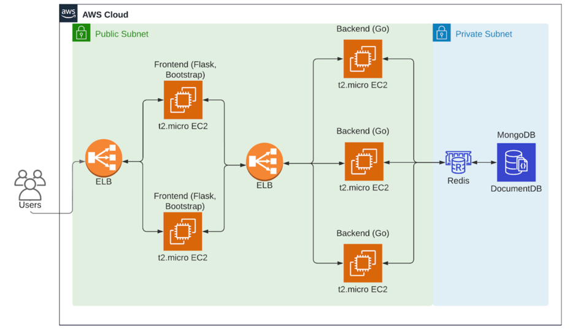

# Anti-phishing Club

## How to set up our code in AWS environment

### Overall architecture
      
   Our overall architecture is shown in the figure below


### 1. Create EC2 instance
1. Choose Instance Type, image and storage needed

   You can choose the instance type according to your business needs, we use t2.micro 
2. Configure Security Group

   Please ensure that the corresponding port can be accessed
3. Configure access info
   
   Keep your key pair carefully

### 2. Create AWS MemoryDB
1. Configure VPC and subnet
2. Choose Node type in cluster and replica info

   You can choose the node type according to your business needs, we use r6g.large
3. Configure Security Group

### 3. Create AWS DocumentDB
1. Choose Instance class and Number of instances

   You can choose the instance class and number according to your business needs, we use 2 r4.large instance
2. Configure Authentication
 
### 4. Create Load Balancer
1. Configure Load Balancer Protocol & Port and Instance Protocol & Port
2. Assign Security Group

   Please ensure that the corresponding port can be accessed
3. Add EC2 Instances 
   
   we need to plan the port usage of each instance in advance

### 5. Deploy Flask application
1. Clone our repo to local environment

    ``` git clone git@github.com:UUUa/NUS_CS5224.git ```
2. install our the dependency needed
3. Configure api_uri in `config.json`
4. Run Flask application

    ``` python run main.py ```

### 6. Deploy API server (GoLang based)
1. Clone our repo to local environment

   ``` git clone git@github.com:UUUa/NUS_CS5224_be.git ```
2. install our the dependency needed
    
   ``` git mod tidy ```
3. Configure dbURL, dbName and redisAddr in `config.json`
4. Run Flask application

   ``` go run main.go ```

### 7. Enjoy our service !!!